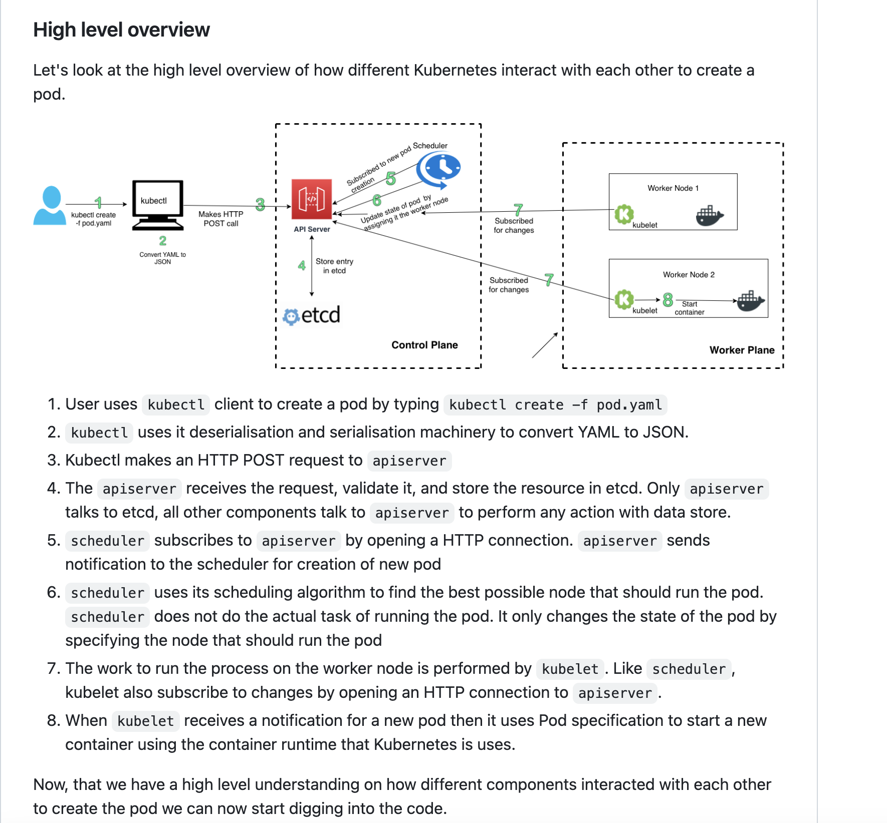

# KUBERNETES

## I - Architecture et Environnement Kubernetes

### 1 - Presentation

* https://www.redhat.com/fr/topics/containers/kubernetes-architecture

#### 1.1 Commnunication interne



### 2 - Environnement

#### 2.1 Les clusters opensource
```
 - minikube
 - kind
 - k3s
 - kuberentes from scratch
```


## II - Installation

### 1 - Installer minikube
```
 - https://minikube.sigs.k8s.io/docs/start/
```

### 2 - Installer kubectl
```
 - 
```